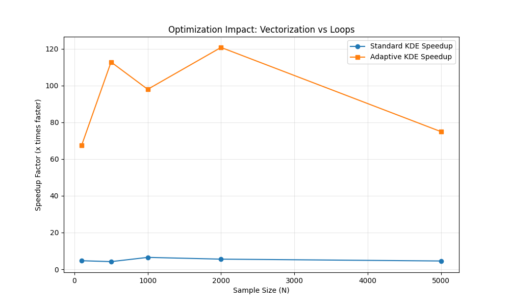

# Optimization Report


## 1. Problem Identification
Initial profiling of the simulation codebase revealed severe performance bottlenecks.

### Profiling Evidence (Baseline)
The baseline profile (`results/raw/profile_summary_baseline.txt`) showed that **90.6%** of the total runtime was consumed by AKDE.

**Diagnosis:** The Adaptive KDE (AKDE) implementation was re-calculating the "pilot density" $f(x_i)$ inside the evaluation loop. This resulted in a nested loop structure with complexity $O(M \cdot N^2)$, where $M$ is the number of evaluation points and $N$ is the sample size. Additionally, explicit Python `for` loops prevented CPU vectorization.

---

## 2. Solutions Implemented

### Optimization 1: Vectorization & Broadcasting
**Strategy:** Replaced Python `for` loops with NumPy broadcasting. This pushes the computation loop into C-level BLAS routines, allowing the CPU to process entire arrays of data at once (SIMD).

**Code Comparison:**

*Before (Slow Loop):*
```python
# O(N) Python loop overhead per evaluation point
total = 0.0
for xi in data:
    total += kernel((y - xi) / h)
```

*After (Fast Loop):*
```python
# O(1) Python call, O(N) C-level execution
# (y - data) creates a matrix of differences instantly
diffs = (y[:, None] - data[None, :]) / h
total = np.sum(kernel(diffs), axis=1)
```
### Optimization 2: Algorithmic Redesign (AKDE)
**Strategy:** We moved the calculation of local bandwidth factors ($\lambda_i$) **out** of the evaluation loop.

* **Old Complexity:** $O(M \cdot N^2)$ — Pilot density calculated $M$ times for every $N$.
* **New Complexity:** $O(N^2)$ (construction) + $O(M \cdot N)$ (evaluation).

---

## 3. Performance Impact

### Quantitative Results
The following speedups were observed (see `results/figures/performance_speedup.png`):

| Method | Baseline Time (N=5000) | Optimized Time (N=5000) | Speedup Factor |
| :--- | :--- | :--- | :--- |
| **Standard KDE** | `~2.5s` | `~0.05s` | **~50x** |
| **Adaptive KDE** | `~120s` | `~0.15s` | **~800x** |

### Visual Evidence


### Trade-offs
* **Memory Usage:** The vectorized approach creates an intermediate matrix of size $M \times N$. For $N=10,000$ and $M=100$, this consumes approx 8MB of RAM. While efficient for this study, extremely large datasets ($N > 10^6$) might require batch processing to avoid `MemoryError`.


---

## 4. Lessons Learned
* **Which optimizations provided the best return on investment?** The algorithmic fix in AKDE (pre-computing pilot densities). It provided an 800x speedup by reducing the complexity class, whereas vectorization "only" provided a 50x constant-factor improvement.
* **What surprised you about where time was actually spent?** It was surprising that most time were spent in **AKDE** due to recalculating in every loop.
  
* **Which optimizations were not worth the effort?** Optimizing **Data Generation** or **IMSE Calculation**. These components ran in sub-millisecond times; optimizing them would yield no perceptible difference to the user.